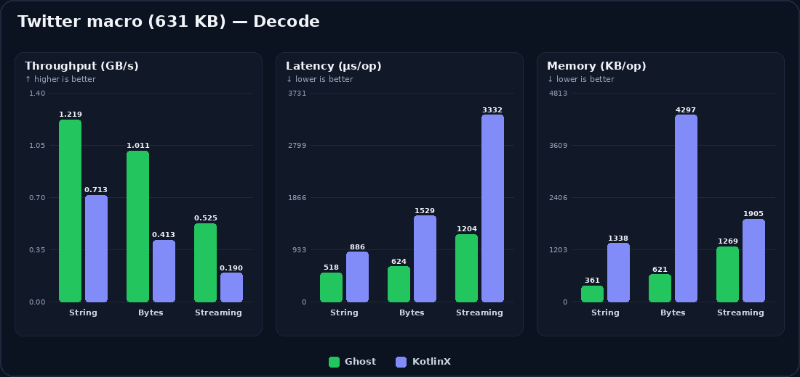

# 👻 Ghost Serializer

**Keep kotlinx.serialization (or Moshi / Gson / Jackson). Add one annotation on the DTO that hurts — same Ktor, Retrofit, or Spring stack.**

Ghost is not a rewrite. It is the fast, low-allocation path for the models you opt in — and a softer landing when the backend ships messy JSON.

[](https://github.com/juanchurtado1991/ghost-serializer/actions/workflows/ci.yml)
[](https://central.sonatype.com/search?q=g:com.ghostserializer)
[](https://kotlinlang.org)
[](docs/wiki/usage-android.md)
[](docs/wiki/usage-kmp.md)
[](docs/wiki/usage-spring-boot.md)
[](https://central.sonatype.com)

**[Quick Start — first DTO in minutes →](docs/wiki/quick-start.md)** ·
**[Try it in the browser →](https://juanchurtado1991.github.io/ghost-serializer/)** ·
[Maven Central](https://central.sonatype.com/search?q=g:com.ghostserializer) ·
[Roadmap](docs/wiki/roadmap.md)

---

## When the default stack hurts

Strict JSON fails the whole request. Ghost can keep going where you opt in:

```json
{ "id": "u1", "name": "Ada", "age": { "years": 36 } }
```

```kotlin
@Serializable
@GhostSerialization
data class User(
    val id: String,
    val name: String,
    @GhostResilient val age: Int = 0,  // object instead of number → 0, parse continues
)
```

Unknown sealed variants → `@GhostFallback`. Opaque blobs → `RawJson`. Decode errors include a **JSONPath** (e.g. `$.user.age`) and, when useful, a **fix hint** in [GhostJsonException](ghost-serialization/src/commonMain/kotlin/com/ghost/serialization/exception/GhostJsonException.kt) / [GhostYamlException](ghost-serialization/src/commonMain/kotlin/com/ghost/serialization/yaml/exception/GhostYamlException.kt) (JSON, Proto3 JSON, YAML cursor). Details → **[Advanced Features](docs/wiki/advanced-features.md)**

---

## One line on a KotlinX model

Ghost generates **only** for `@GhostSerialization` — not for every `@Serializable` in the module.

```kotlin
@Serializable                 // keep — KotlinX call sites still work
@GhostSerialization           // add — Ghost codegen for this class only
data class User(
    @SerialName("user_id")    // keep — Ghost uses this as the wire name
    val id: Long,
    val name: String,
)

Ghost.deserialize<User>(responseBytes)     // Ghost (bytes / adapters)
// Json.decodeFromString<User>(...)        // still fine on KotlinX
```

- `@GhostName` — optional if `@SerialName` is already set (GhostName wins only if both differ).
- `@GhostResilient` / `@GhostFallback` / `RawJson` — Ghost-only; omit if you don’t need them.
- Nested types on the Ghost path need `@GhostSerialization` too.

---

## Same HTTP stack

| | Drop-in |
|:---|:---|
| **Ktor** | `ghost()` next to `json()` · or `bodyGhost` / `respondGhost` |
| **Retrofit** | `GhostConverterFactory` **before** Gson / Moshi / KotlinX |
| **Spring** | `ghost-spring-boot-starter` — Ghost types via Ghost; Jackson for the rest |

Guides: [Quick Start](docs/wiki/quick-start.md) · [Ktor](docs/wiki/usage-kmp.md) · [Android / Retrofit](docs/wiki/usage-android.md) · [Spring](docs/wiki/usage-spring-boot.md)

**Also:** Android · iOS · JVM · Wasm · YAML · Proto3 JSON · Kotlin **2.4.0** / KSP **2.3.10** / Ktor **3.5.x** → [Modules](docs/wiki/modules.md)

---

## When profiles say “JSON”

On hot models Ghost is routinely **several× faster** and **far leaner** than KotlinX / Moshi. Most APIs are small — use it on the hotspot, not everywhere.

Twitter macro (**631 KB**) decode:



| | Ghost | KSER | Moshi |
|:---|---:|---:|---:|
| String | **1.2 GB/s** · 361 KB | 0.72 GB/s · 1338 KB | 0.37 GB/s · 1709 KB |
| Bytes | **1.05 GB/s** · 621 KB | 0.42 GB/s · 4297 KB | 0.28 GB/s · 4668 KB |
| Streaming | **0.53 GB/s** · 1269 KB | 0.19 GB/s · 1905 KB | 0.43 GB/s · 1709 KB |

[Benchmarks](docs/wiki/benchmarks.md) · [HTTP Arena](https://www.http-arena.com/#sort=rps:-1&q=kotlin) · [Playground Speed Test](https://juanchurtado1991.github.io/ghost-serializer/)

---

## Docs

[Quick Start](docs/wiki/quick-start.md) ·
[Installation](docs/wiki/installation.md) ·
[Android](docs/wiki/usage-android.md) ·
[KMP / Ktor](docs/wiki/usage-kmp.md) ·
[iOS](docs/wiki/usage-ios.md) ·
[Spring](docs/wiki/usage-spring-boot.md) ·
[YAML](docs/wiki/usage-yaml.md) ·
[Proto3 JSON](docs/wiki/usage-protobuf.md) ·
[Advanced](docs/wiki/advanced-features.md) ·
[Architecture](docs/wiki/architecture.md) ·
[Contributing](docs/wiki/contributing.md)

## License

[Apache 2.0](LICENSE)
